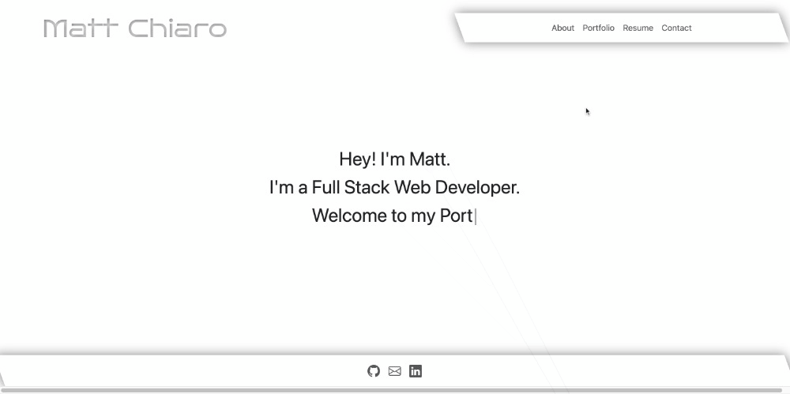

# react-portfolio

## Description

Here it is! A new portfolio built with React. This portfolio is a single page application that uses React Router to navigate between pages. The portfolio is fully responsive and uses Bootstrap for styling. in addition, I used the following technologies and packages to make the site more interactive and exciting:
* [React-Bootstrap](https://react-bootstrap.github.io/)
* [React-Router-Dom](https://www.npmjs.com/package/react-router-dom)
* [React-Icons](https://react-icons.github.io/react-icons/)
* [Typerwriter Effect](https://www.npmjs.com/package/typewriter-effect)
* [Framer Motion](https://www.framer.com/motion/)

## Usage

Project is fully deployed [here.](https://mattchiaro.github.io/react-portfolio)

## License

